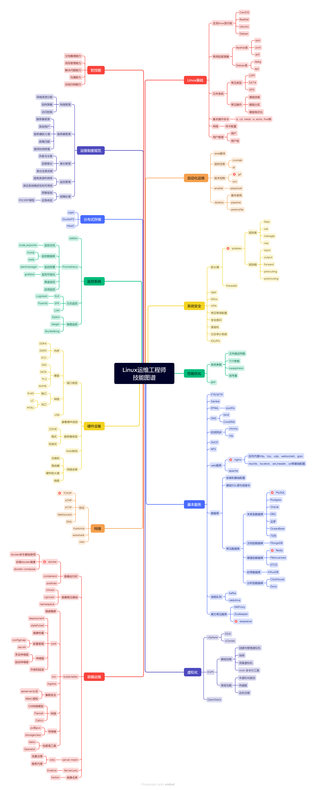

## 简介

运维如今是个很宽泛的概念，也有很多的细分类，比如系统运维、网络运维、实施运维、数据库运维、桌面运维、IDC运维、安全运维等等，似乎只要是运营+IT技术的岗位就可以称为运维。小公司里面可能只有一个运维岗位，这个运维工程师可能既要会linux和windows的系统运维，还要懂交换机和路由器配置，数据库也要会点，打印机问题也要处理，平时可能还要帮同事修电脑。

总体来看，运维工程师的特点就是知识点多而不精，啥都会点，但啥都不精。个人认为，从初级到中级就是个多而不精的过程，如果要从中级进阶到高级，就要考虑从众多领域中选一个或几项进行专精突破。

每个细分类都有知识点交叉，不过侧重点不同，以下内容会根据侧重点做一个大致的分类。

## Linux运维工程师

Linux运维工程师以Linux操作系统为重点，基础的技术栈为Linux基础操作+Web服务器+数据库服务器。

国内主流的Linux发行版为CentOS和Ubuntu，分别代表RedHat系和Debian系，总体来说区别不大，除了包管理器不同，常用命令都是一样的。

主流的Web服务器有Apache和Nginx，Nginx稍微多点。

主流的数据库有MySQL、Oracle和Redis，MySQL作为开源数据库，市场占有率更高点。不管关系型数据库用的是MySQL还是Oracle，亦或Postgres、DB2等等，SQL语法才是基础。

由于微服务技术的广泛应用，自动化和容器技术也成了运维工程师的必会知识点，其中自动化的主流技术栈为Git+Ansible+Jenkins，容器技术栈为Docker+Kubernetes。

个人认为网络技术应当归为网络工程师的技术范畴，但实际工作中经常遇到网络相关问题，因此除了基础的TCP/IP协议，vlan、组网策略、交换机等也要有所了解。

